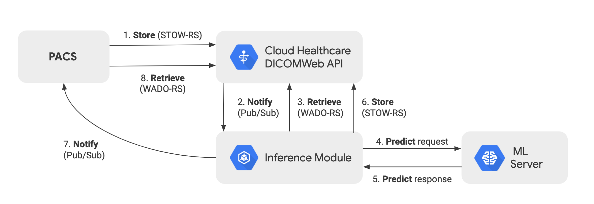

# Google Cloud Healthcare Demo
This demo web application acts as a client in a simulated clinical workflow for online radiology diagnostics. The data is based on the TCIA CBIS-DDSM dataset which contains ~2500 mammography images in DICOM format. Each image is given a BI-RADS breast density score from 1 to 4.

This demo app is based on the results of the following codelab https://github.com/GoogleCloudPlatform/healthcare/tree/master/imaging/ml/ml_codelab. In that codelab you can learn more about Google's Healthcare API as well as building and deploying a model.

## Demo Workflow Explained

This demo app acts as the client PACS system in the workflow depicted above. This just one example of a workflow design. The steps are as follows:

1. PACS uploads the DICOM image to the DICOM store. In this case we download a file from a public dataset available on a Google Cloud storage bucket.
2. The DICOM store emits a Pub/Sub notification.
3. The Inference Module is listening for such events and retrieves the DICOM file.
4. It then submits a prediction request against our online model.
5. The response is then sent back to the Inference Module (synchronously).
6. A DICOM Structured Report is created and inserted into the DICOM store.
7. A Pub/Sub notification is then issued, picked up by our demo client and the results displayed.

## Usage
Click on the "Process" button and watch the magic happen. Click on the "Cleanup After" button when done.

If you want to use a different DICOM image, you can browse the public data set available here : gs://gcs-public-data--healthcare-tcia-cbis-ddsm/dicom/.  Go to https://cloud.google.com/healthcare/docs/resources/public-datasets/tcia#cloud-healthcare-api" to request permissions to access the tcia dataset and access the GCP Project. 

## How To Build Yourself
TODO

## Disclaimer
* This is not an officially supported Google repository/product.
* It is not a statement of best practices nor is it meant for production usage.
* Don't be that cut and paste coder!
